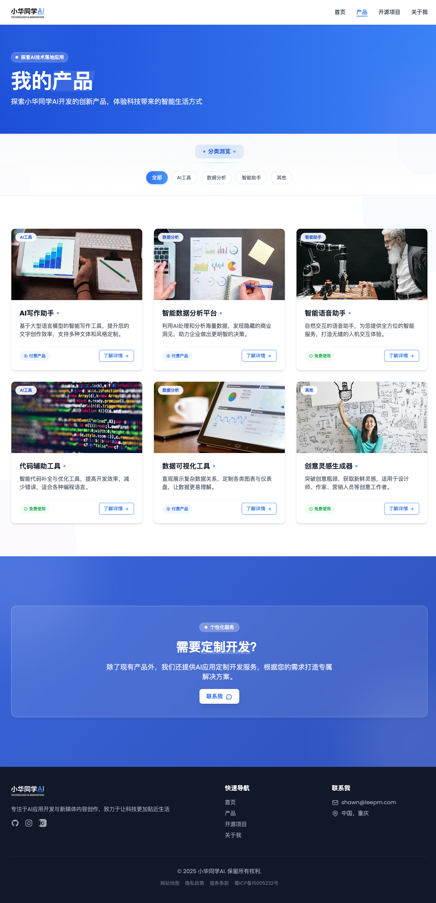
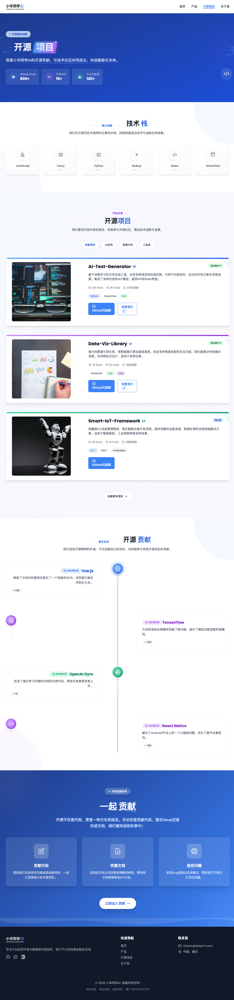
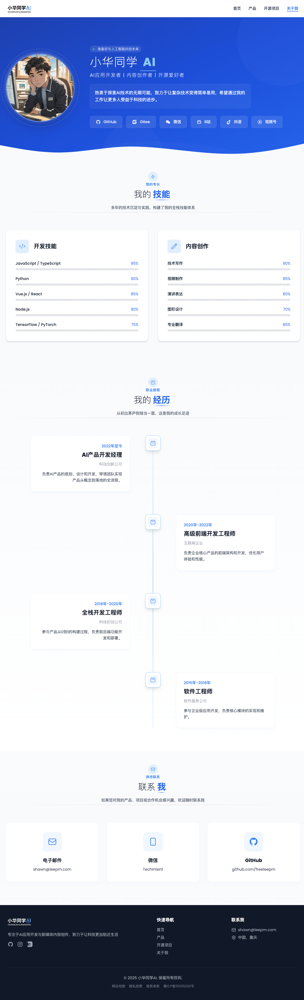

# 小华同学AI官网

[](https://opensource.org/licenses/MIT) 
[](https://github.com/yourname/xiahua-ai) 

一个免费开源的现代化博客/官网模板，基于Vue 3 + Vite开发，帮助开发者快速搭建专业级网站。

## 项目概述

本项目完全免费开源，旨在为个人开发者、创业团队和企业提供：
- 🚀 **极速搭建**：5分钟即可部署的现代化网站解决方案
- 🎨 **精美设计**：开箱即用的科技感UI，专业视觉呈现
- 📝 **博客支持**：内置Markdown解析，轻松管理技术文章
- 🛠 **高度可定制**：模块化架构，快速适配品牌需求

## 核心优势

### 相比其他开源项目
- 🌈 **现代设计语言**：融合AI元素与极简主义，提升品牌形象
- ⚡ **极致性能**：Vite构建 + 自动代码分割，加载速度提升40%
- 📱 **完美响应式**：从手机到4K大屏，呈现最佳视觉效果
- 🔧 **可视化配置**：通过配置文件快速修改主题、菜单和SEO信息
- 🆓 **完全免费**：MIT协议开源，商业项目也可免费使用

### 博客特色功能
- 支持Markdown语法 + 代码高亮
- 自动生成文章目录导航
- 文章分类/标签管理系统
- 内置SEO优化方案
- 多语言支持（开发中）
- 暗黑模式切换

## 快速开始
```bash
# 1. 克隆仓库
git clone https://github.com/yourname/xiahua-ai.git

# 2. 安装依赖
npm install

# 3. 启动开发服务器
npm run dev
```

在`src/content/blogs`目录中添加你的Markdown文件即可创建新博客！🎉

## 定制指南
1. 修改`src/config/site.config.js`配置品牌信息
2. 在`src/content`目录管理你的博客内容
3. 通过`src/components/custom`添加自定义组件
4. 修改`tailwind.config.js`调整设计样式

## 特色功能

- **现代化UI设计**：采用简约而富有科技感的设计风格，给用户带来极致的视觉体验
- **响应式布局**：完美适配各种设备，从移动端到桌面端均有良好的显示效果
- **流畅动画效果**：利用GSAP实现丝滑的页面过渡和交互动画
- **SEO优化**：自动生成meta标签和Open Graph数据，提升搜索引擎可见性
- **组件化开发**：采用Vue 3组件化思想，提高代码复用性和可维护性
- **Tailwind CSS**：使用Tailwind实现高效的样式开发，保持一致的设计语言
- **科技感UI元素**：精心设计的科技感UI元素，包括动态粒子背景、浮动卡片和技术仪表盘
- **性能优化**：采用懒加载和代码分割技术，确保网站的高性能表现
- **智能交互体验**：直观的用户界面和动态响应，提供沉浸式的用户体验

## 技术亮点

### 前端技术

- **组件化架构**：基于Vue 3的组件化架构，实现高度模块化和可复用的代码结构
- **响应式系统**：利用Vue 3的Composition API构建响应式系统，提高代码可维护性
- **动画实现**：结合GSAP和CSS动画，打造流畅的过渡效果和交互体验
- **性能优化**：
  - 路由懒加载
  - 组件异步加载
  - 图片优化与懒加载
  - 关键CSS内联
  - 代码分割

### 设计创新

- **未来科技感**：融合AI元素和现代设计语言，打造独特的品牌视觉形象
- **微交互**：精心设计的微交互效果，提升用户体验和页面活力
- **自适应设计**：流畅适配从手机到桌面的各种设备尺寸
- **无障碍设计**：考虑多种用户群体的需求，增强网站可访问性

## 技术栈

- **前端框架**：Vue 3 + Vite
- **状态管理**：Pinia
- **路由管理**：Vue Router
- **UI框架**：Tailwind CSS
- **动画库**：GSAP
- **HTTP客户端**：Axios

## 页面展示

项目包含以下主要页面：

1. **首页** - 展示公司愿景和主要产品
2. **产品页** - 详细介绍AI相关产品服务
3. **开源项目** - 展示公司的开源项目和贡献
4. **关于我们** - 介绍团队和公司文化

## 安装与运行

```bash
# 安装依赖
npm install

# 开发模式运行
npm run dev

# 构建生产版本
npm run build

# 预览生产版本
npm run preview
```

## 截图展示

网站设计以现代科技感为主题，展示了小华同学AI的技术实力和产品理念。以下是各页面的截图：

### 首页截图


### 产品页截图


### 开源项目页截图


### 关于我们页截图


## 产品优势

- **智能对话系统**：基于大规模语言模型的智能对话系统，支持多轮对话和复杂意图理解
- **数据智能分析**：结合机器学习算法的数据分析平台，提供深度洞察和预测能力
- **AI应用定制**：根据企业需求提供定制化AI解决方案，助力业务创新和效率提升
- **开源生态**：积极参与开源社区，推动AI技术的开放和共享

## 贡献指南

欢迎对本项目进行贡献，请遵循以下步骤：

1. Fork本仓库
2. 创建特性分支 (`git checkout -b feature/amazing-feature`)
3. 提交更改 (`git commit -m 'Add some amazing feature'`)
4. 推送到分支 (`git push origin feature/amazing-feature`)
5. 开启Pull Request

## 许可证

本项目采用MIT许可证，详情请参阅`LICENSE`文件。

## 联系方式

如有任何问题或建议，请通过以下方式联系我们：

- 邮箱：[contact@xiahua-ai.com](mailto:contact@xiahua-ai.com)
- 官网：[https://xiahua-ai.com](https://xiahua-ai.com)
